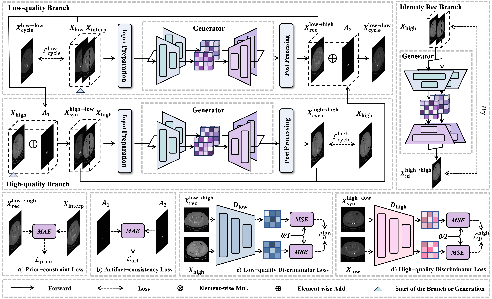
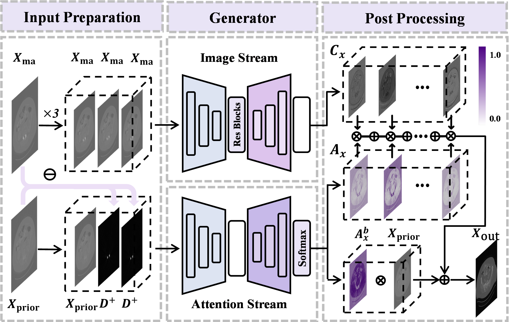
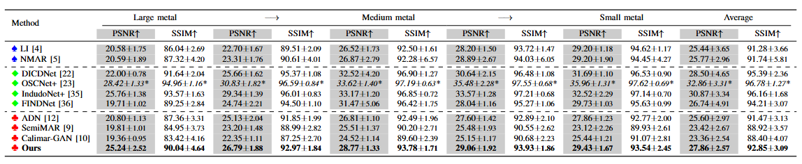
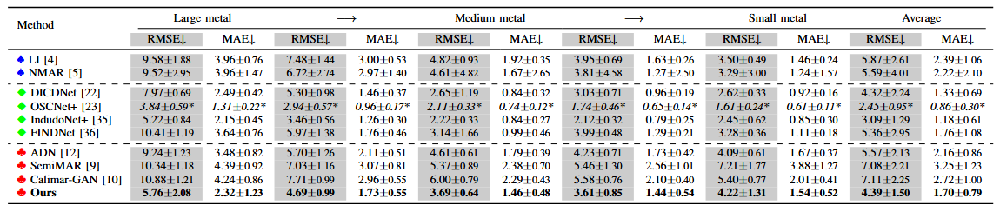
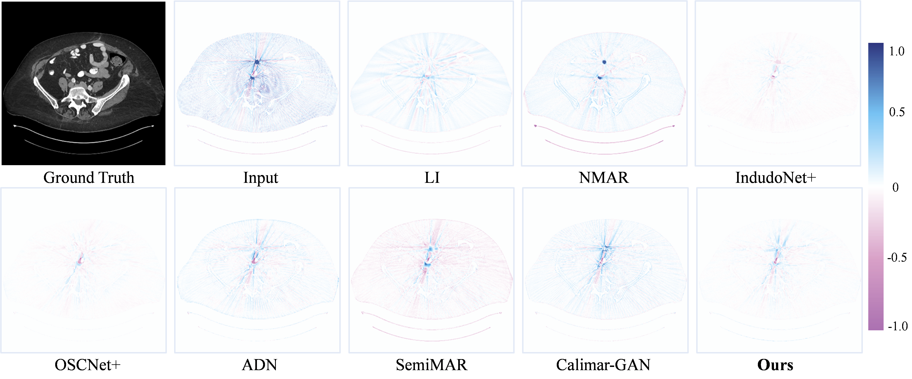
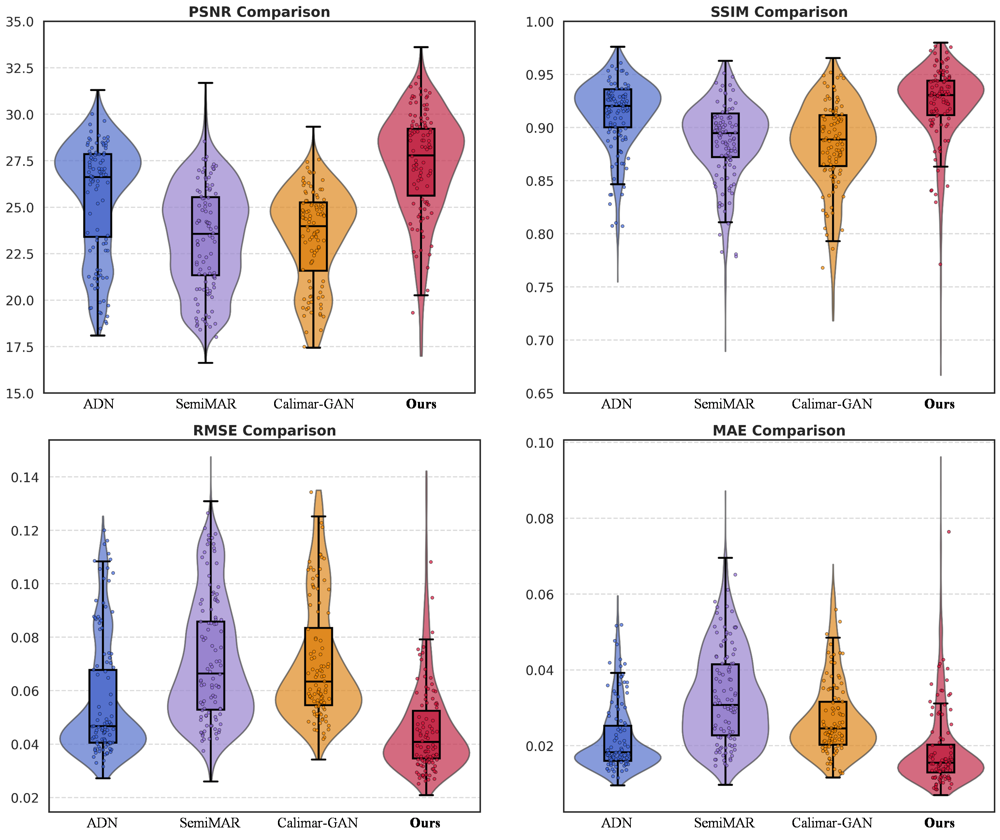

# :dizzy:PRISM: Physics-Regularized Inference for Safe Metal-artifact Reduction 
***

This code is a **pytorch** implementation of our paper "**PRISM: Physics-Regularized Inference 
for Safe Metal-artifact Reduction**".

***

## :computer:Proposed method
***

The proposed PRISM Generator.

***
## :triangular_flag_on_post:Comparison
***
#### - PSNR/SSIM comparison of different MAR methods on the Synthetic DeepLesion dataset.

#### - RMSE/MAE comparison of different MAR methods on the Synthetic DeepLesion dataset.

#### - Qualitative results on synthetic data (window 450/50 HU).

#### - Residual error maps for large-metal cases.

#### - Residual error maps for medium-metal cases.

#### - Residual error maps for small-metal cases.

#### - Quantitative distribution on synthetic data.

#### - Clinical SpineWeb results (window 1500/500 HU).

#### - Clinical pelvic CT results (window 450/50 HU).

***
## :book:Ablation study

#### - Quantitative evaluation of the Image Fusion Strategy on the Synthetic DeepLesion dataset with different numbers of input slices

#### - Quantitative evaluation of the Loss Function Components on the Synthetic DeepLesion dataset with different configurations

***
## :gear:Pre-requisties

<ul>
<li> Linux
<li> python == 3.8
<li> Cuda 11.8
</ul>

***
## :open_file_folder:Datasets

The DeepLesion dataset can be downloaded at https://nihcc.app.box.com/v/DeepLesion and the preprocessing method can be found at https://github.com/hongwang01/InDuDoNet.

***
## 🫳Install dependencies

    pip install -r requirements.txt

***
## 🐎Training

    python train.py deep_lesion

***
## 🔍Test

    python test.py deep_lesion

