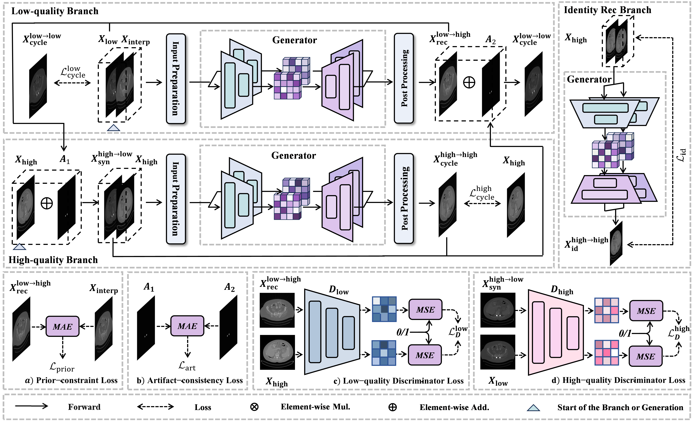
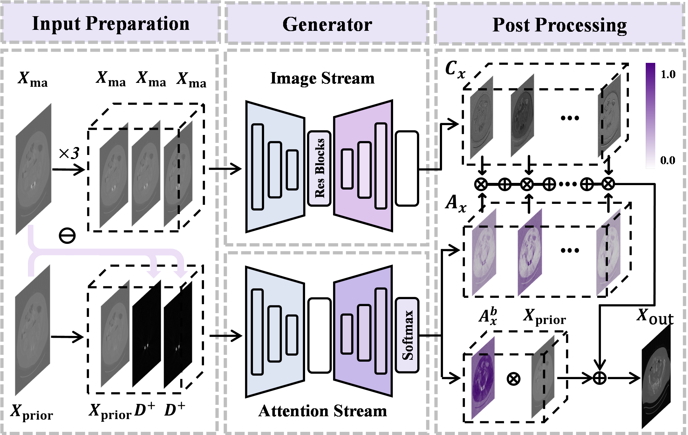
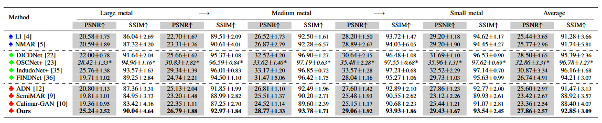
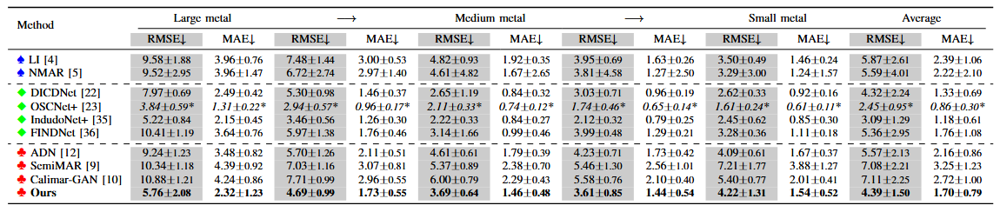

# 💫

# Unsupervised CT Metal Artifact Reduction via Consistent Artifact Modeling

---

This code is a **pytorch** implementation of our paper "**Unsupervised CT Metal Artifact Reduction via Consistent Artifact Modeling**".

## 💻Proposed method

---

The proposed CAM Generator.

---

## 🚩Comparison

---

#### - PSNR/SSIM comparison of different MAR methods on the Synthetic DeepLesion dataset.

#### - RMSE/MAE comparison of different MAR methods on the Synthetic DeepLesion dataset.

#### - Qualitative results on synthetic data (window 450/50 HU).

#### - Residual error maps for large-metal cases.

#### - Residual error maps for medium-metal cases.

#### - Residual error maps for small-metal cases.

#### - Quantitative distribution on synthetic data.

#### - Clinical SpineWeb results (window 1500/500 HU).

#### - Clinical pelvic CT results (window 450/50 HU).

---

## 📖Ablation study

#### - Qualitative results on Analysis of the High-order Interaction modules.

FSIM and GCIM represent individual interaction modules, respectively. The notation GCIM->FSIM indicates a serial structure with the order reversed.

---

## ⚙️Pre-requisties

<ul>
<li> Linux
<li> python> =3.8
<li> Cuda 11.8
</ul>

---

## 📂Datasets

The M3FD dataset with mask can be downloaded at https://drive.google.com/drive/folders/1J15Kt8hiwDoB24FEMPKiofn_4dD0tpFz?usp=drive_link.

---

## 🫳Install dependencies

    pip install -r requirements.txt

---

## 🐎Training

if you want to train on your own datasets,you can use vsm.m to generate mask for training. Please run the following command to train:

    python train.py -opt train.yml

---

## 🔍Test

You can run the follow command for testing:

    python test.py -opt test.yml
